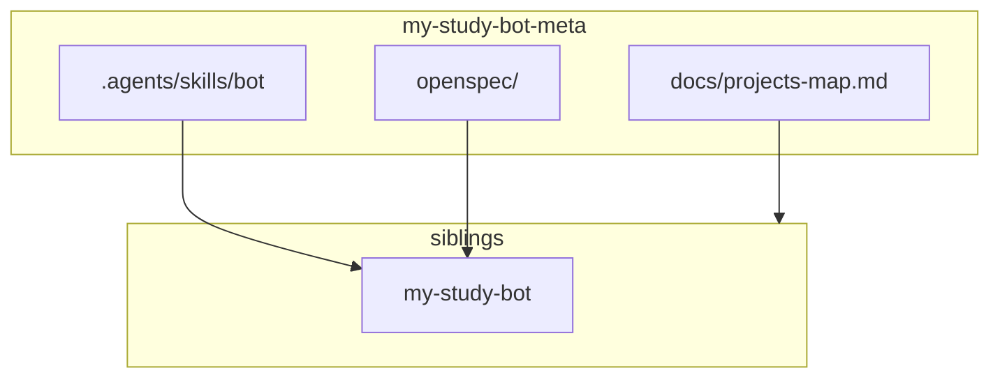

# Карта проектов: сервис → sibling-репозиторий

Канон соответствия сервисов экосистемы My Study Bot (Telegram study bot) путям в workspace разработчика. Исходный код **не** хранится в `my-study-bot-meta` — клонируется рядом (sibling `my-study-bot`). Локальные отклонения путей — в [`projects-map.local.yaml`](../projects-map.local.yaml) (см. ниже).

См. также: [README.md](README.md) (оглавление docs), пакетный [`../my-study-bot/AGENTS.md`](../my-study-bot/AGENTS.md).

## Layout workspace

```
<workspace>/                          # напр. my_study_bot (не git)
├── my-study-bot-meta/                # этот репозиторий: docs, OpenSpec, AI skills
└── my-study-bot/                     # Telegram bot (aiogram 3 + SQLAlchemy / SQLite)
```

Пути в таблицах ниже — **относительно корня `my-study-bot-meta`**, по умолчанию `../my-study-bot/...`.

## Bot

| Сервис | Роль | Git-репозиторий | Путь исходников | Документация / контекст |
|--------|------|-----------------|-----------------|-------------------------|
| **Bot** | aiogram 3 long-polling Telegram study bot | `my-study-bot` | `../my-study-bot/` | runtime: `../my-study-bot/AGENTS.md`; skills: `.agents/skills/bot/` в meta |

Runtime-код и пакетный `AGENTS.md` живут **в sibling-репозитории**. Bot skills и OpenSpec — в **my-study-bot-meta** (`.agents/skills/bot/`, `openspec/`).

## Локальный `projects-map.local.yaml`

У каждого разработчика свой файл в корне `my-study-bot-meta` (в git **не** коммитится). Шаблон: [`projects-map.local.yaml.example`](../projects-map.local.yaml.example).

Ключи совпадают с таблицей «Пути для OpenSpec / агентов». Значения — относительные (от корня `my-study-bot-meta`) или абсолютные пути.

```yaml
bot: ../my-study-bot
```

**Resolution из корня `my-study-bot-meta`**

1. Прочитать канон (этот файл).
2. Если существует `projects-map.local.yaml` — смержить: local **перекрывает** канон по ключу.
3. Относительные пути резолвить от корня `my-study-bot-meta`; проверить, что корень существует (например `{bot}/main.py` или `{bot}/requirements.txt`).
4. Если путь не найден — **спросить у пользователя**, не угадывать.

## Child `project-map.md`

В корне sibling-репозитория — `project-map.md` с ключом **`my-study-bot-meta`** (относительный путь к этому метарепозиторию).

| Расположение клона | Значение `my-study-bot-meta` (default sibling layout) |
|--------------------|--------------------------------------------------------|
| `<workspace>/my-study-bot/` рядом с `my-study-bot-meta` | `../my-study-bot-meta` |

Пример (в корне bot):

```markdown
| Key | Relative path |
|-----|---------------|
| my-study-bot-meta | ../my-study-bot-meta |
```

**Resolution из sibling-репо**

1. Прочитать локальный `project-map.md`, ключ `my-study-bot-meta`.
2. Корень валиден, если существует `{my-study-bot-meta}/docs/projects-map.md`.
3. Далее — канон + опциональный `{my-study-bot-meta}/projects-map.local.yaml`.
4. Если не найдено — спросить абсолютный путь к `my-study-bot-meta`.
5. Ссылки в child markdown на канон: `my-study-bot-meta/docs/...` (не `../../docs/...`).

## Пути для OpenSpec / агентов

Канон путей к исходникам **от корня `my-study-bot-meta`**. Перед доступом читать эту таблицу (+ local YAML). OpenSpec: [openspec/config.yaml](../openspec/config.yaml) (`projectsMap` → этот файл).

| Ключ | Путь (от корня my-study-bot-meta) | Назначение |
|------|-------------------------------------|------------|
| `bot` | `../my-study-bot/` | Telegram study bot (`my-study-bot`) |
| `bot.agents` | `../my-study-bot/AGENTS.md` | продукт / стек / домены bot |
| `bot.main` | `../my-study-bot/main.py` | entry: Bot / Dispatcher / polling |
| `bot.app` | `../my-study-bot/app/` | пакет приложения |
| `bot.handlers` | `../my-study-bot/app/handlers.py` | Router handlers |
| `bot.database` | `../my-study-bot/app/database.py` | engine, User model, `init_db` |
| `bot.middlewares` | `../my-study-bot/app/middlewares.py` | `DbSessionMiddleware` |
| `bot.keyboards` | `../my-study-bot/app/keyboards.py` | Inline topic-menu builders (`menu:*`) |
| `bot.states` | `../my-study-bot/app/states.py` | FSM `StatesGroup` |
| `bot.data` | `../my-study-bot/data/` | SQLite volume (`db.sqlite3`) |
| `bot.deploy` | `../my-study-bot/` | `Dockerfile`, `docker-compose.yml`, `.github/workflows/` |

Команды из каталога пакета (ключ `bot`):

- `pip install -r requirements.txt`
- `python main.py`
- `pytest` (когда есть `tests/`)
- Docker: `docker compose build` / `docker compose up -d`

Команды запускает **агент** из каталога sibling-репо (`my-study-bot`). Не ждать подтверждения пользователя; при падении — починить до завершения задачи.

## Skills discovery

- OpenSpec (meta): `.agents/skills/` (`openspec-*`, [`commit`](../.agents/skills/commit/SKILL.md))
- Bot-wide (meta): [`.agents/skills/bot/`](../.agents/skills/bot/) — runtime bot в `../my-study-bot/`
- Индекс: [`.agents/AGENTS.md`](../.agents/AGENTS.md)

## Связь docs ↔ siblings


